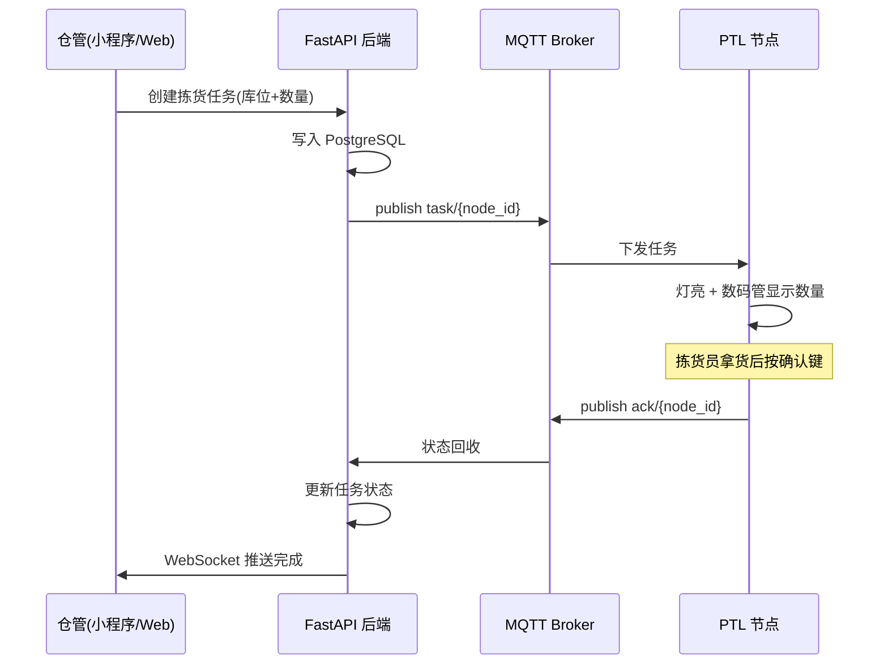
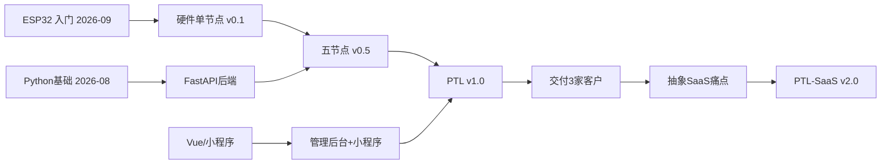

# PTL 项目章程（Project Charter）

> **PTL = Pick-To-Light** · 电子标签拣货 / 指示灯系统
> ESP32 + 数码管 + 按键 + WiFi/MQTT + 后端调度，多节点联网，为仓库 / 门店 / 小微工厂提供拣货指引。
>
> 本文件是 PTL 的"宪法"。任何关于 PTL 的决策，先回到这里对齐。

---

## 元信息

| 项 | 内容 |
|----|------|
| 项目代号 | **PTL**（Pick-To-Light）|
| 定位 | LifeOS 全年**旗舰定制化项目**（双轨制"定制轨"的载体）|
| 创建日期 | 2026-07-20 |
| 负责人 | 老陈（一人全栈：硬件 + 固件 + 后端 + 前端 + AI）|
| 当前阶段 | **筹备期**（原型定于 2026-11）|
| 代码仓库 | `~/Workspace/Projects/ptl-*`（按子系统拆多仓）|
| 文档仓库 | `~/Workspace/LifeOS/Users/chuan/Desktop/DeerFlow/ProjectNotes/PTL/`（本目录）|
| 关联 OKR | O1(AI) · O3(Vue/小程序) · O4(Python) · O5(嵌入式) · O6(双轨产品) |
| 关联 Roadmap 里程碑 | 2026-11 单节点 · 2027-01 首付费 · 2027-03 v1.0 交付 3 家 |

---

## 1. 为什么做 PTL（Why）

### 1.1 一句话使命
> **用最低成本的软硬件方案，帮小微仓库/门店把"找货、拣货、盘点"从靠记忆和纸单，变成"灯亮了就拿"。**

### 1.2 为什么是我（个人战略角度）
- **它是六项技能唯一的"总装载体"**：嵌入式（硬件+固件）、Python（后端）、Vue/小程序（前端）、AI（语音下单/图像拣货）、英语（出海文档）——PTL 一个项目全用上，完美符合 PBL 学习哲学。
- **它是"软硬件结合"护城河**：纯软件人做不了硬件，纯硬件人做不了云端调度，AI 时代纯代码越来越不值钱，**软硬一体 + AI** 才是 37 岁网管转型能建立的差异化。
- **它有清晰的现金流路径**：单节点 BOM 成本可压到 ¥30 以内，定制一套（10-30 节点 + 后台）报价 ¥3,000-8,000，验证后可 SaaS 化收月费。
- **它天然是内容素材**："37 岁网管从零做一套拣货系统"——从选料、焊板、调固件到交付客户，全程可拍。

### 1.3 为什么不做别的（Not This）
- ❌ 不做智能鱼缸/智能家居消费品（红海、拼供应链、无壁垒）。
- ❌ 不做纯 App/小程序外包（同质化、压价、无复利）。
- ❌ 不一上来做通用 SaaS（没有真实客户和场景，纯空想）。

---

## 2. 做成什么样（What / 目标定义）

### 2.1 产品形态（三层）
```
┌─────────────────────────────────────────┐
│  云端后台（Vue 管理台 + 小程序）          │  ← 订单/库位/拣货任务管理
├─────────────────────────────────────────┤
│  调度后端（FastAPI + PostgreSQL + MQTT）  │  ← 任务分发、状态回收、AI 模块
├─────────────────────────────────────────┤
│  PTL 节点（ESP32 + 数码管 + 按键 + 指示灯）│  ← 灯亮显示数量，按键确认拣完
└─────────────────────────────────────────┘
```

### 2.2 核心用户故事（MVP）
1. 仓管在后台/小程序创建一个拣货任务（含多个库位 + 数量）。
2. 后端通过 MQTT 把任务下发到对应库位的 PTL 节点。
3. 对应库位**灯亮 + 数码管显示应拣数量**。
4. 拣货员拿完货**按一下确认键**，灯灭，状态回传后端。
5. 全部库位完成 → 任务标记完成，后台可见完成时长与差错。

### 2.3 分版本目标

| 版本 | 时间 | 目标 | 对应 Roadmap |
|------|------|------|-------------|
| v0.1 单节点 | 2026-11 | 1 个节点跑通"灯亮→显示→按键→上报" | ⭐生死里程碑 |
| v0.5 五节点 | 2027-01 | 5 节点 MQTT 联网 + 后端调度 demo | ⭐首个付费客户 |
| v1.0 可交付 | 2027-03 | 后端 v1 + Vue 后台 + 小程序，交付 ≥3 家 | ⭐产品里程碑 |
| v1.5 量产 | 2027-04 | PCB 打样 + 3D 外壳，批量 10-20 个 | 出海期 |
| v2.0 SaaS | 2027-05+ | 多租户 + Stripe，出海订阅 | ⭐出海第一步 |

---

## 3. 技术架构（How）

### 3.1 技术栈选型（一次定死，不反复横跳）

| 层 | 技术 | 理由 |
|----|------|------|
| 硬件主控 | **ESP32**（首选 ESP32-C3，成本低带 WiFi）| 便宜、社区大、自带 WiFi、你正在学 |
| 显示 | TM1637 4 位数码管 | 便宜、库成熟 |
| 交互 | 轻触按键 + WS2812 指示灯 | 简单可靠 |
| 固件 | **Arduino 框架**（起步）→ 视情况 ESP-IDF | 上手快，先跑通再优化 |
| 通信 | **MQTT**（EMQX / Mosquitto）| 物联网标准，低带宽，一对多 |
| 后端 | **FastAPI + PostgreSQL** | 与 O4 学习目标一致，异步性能好 |
| 前端后台 | **Vue 3 + Element Plus** | 与 O3 一致 |
| 移动端 | **微信小程序** | 与 O3 + 亲子项目复用 |
| AI 模块 | 语音下单（Whisper）/ 图像识别拣货 | 与 O1 一致，v1.0 后接入 |
| 部署 | Docker（复用 LifeOS 的 compose）| 统一环境 |

### 3.2 数据流（时序）


### 3.3 里程碑依赖（谁卡谁）


---

## 4. 成本与定价（Money）

### 4.1 单节点 BOM 估算（目标 < ¥30）

| 物料 | 单价(¥) |
|------|--------|
| ESP32-C3 模块 | 12 |
| TM1637 数码管 | 3 |
| WS2812 指示灯 | 1 |
| 轻触按键 + 电阻 | 1 |
| PCB 分摊（批量）| 5 |
| 外壳（3D 打印分摊）| 5 |
| 线材/焊料/杂项 | 3 |
| **合计** | **~30** |

### 4.2 定价策略（定制轨）
- **一套报价** = 节点数 × ¥150-250 + 后台部署费 ¥1,500-3,000。
- 例：20 节点小仓 → 20×¥200 + ¥2,000 = **¥6,000/套**（BOM 成本约 ¥600，含调试上门）。
- **月费运维**（可选）：¥300-800/月（远程监控 + 故障响应）。
- **SaaS 版**（出海）：按节点数订阅，$0.5-1/节点/月。

---

## 5. 里程碑与验收标准（Milestones）

| # | 里程碑 | 验收标准（可打勾/打叉，无中间态）| 截止 |
|---|--------|------------------------------|------|
| M1 | 单节点 v0.1 | 通电后 MQTT 收到任务→灯亮+数码管显示→按键→后端收到 ack | 2026-11-30 |
| M2 | 五节点 v0.5 | 5 节点同网并发下发无冲突，后端 demo 可见全部状态 | 2027-01-31 |
| M3 | 后端 v1 | FastAPI 完整 CRUD + WebSocket + 任务调度，Docker 一键起 | 2027-02-28 |
| M4 | v1.0 交付 | Vue 后台 + 小程序 + 硬件，真实交付 ≥3 家并收款 | 2027-03-31 |
| M5 | 量产 v1.5 | PCB 打样通过 + 3D 外壳定型，批量 10-20 个良率>90% | 2027-04-30 |
| M6 | SaaS v2.0 | 多租户 + Stripe 付费，出海订阅 ≥3 家 | 2027-06-30 |

---

## 6. 风险登记册（Risks）

| 风险 | 概率 | 影响 | 应对 |
|------|------|------|------|
| ESP32 学习曲线超预期 | 中 | 高 | 先买现成开发板 + 例程，不自己画板；单节点跑通再谈联网 |
| 找不到真实客户 | 高 | 致命 | 从自己/熟人小仓库/中山本地小微工厂免费试用切入，先要真实场景 |
| 硬件量产良率/供应链坑 | 中 | 中 | v1.0 前全部用面包板/现成模块，量产推迟到验证付费后 |
| 时间不够（每天仅 2h）| 高 | 高 | 严格 PBL：学的每样都必须直接推进 PTL，不学无关内容 |
| 健康/主业挤占 | 中 | 高 | 遵守 Vision 底线：健康红线优先，PTL 可延后不可透支身体 |
| 一个人全栈顾不过来 | 高 | 中 | 用 AI 补齐弱项（硬件设计/前端），DeerFlow 做技术调研 |

---

## 7. 本目录结构（ProjectNotes/PTL/）

```
ProjectNotes/PTL/
├── 00-charter.md        ← 本文件（项目宪法）
├── 01-hardware/         ← 选料、原理图、BOM、焊接记录、PCB
│   └── README.md
├── 02-firmware/         ← ESP32 固件笔记、Arduino/IDF、MQTT 协议约定
│   └── README.md
├── 03-backend/          ← FastAPI 设计、数据库表、API 文档、MQTT topic 规范
│   └── README.md
├── 04-frontend/         ← Vue 后台 + 小程序 原型、页面、组件笔记
│   └── README.md
├── 05-ai/               ← 语音下单、图像拣货、模型选型与微调笔记
│   └── README.md
├── 99-clients/          ← 客户档案、需求、报价、交付记录、回款
│   └── README.md
└── saas-discovery.md    ← （2027-03 起）从定制中提炼的 SaaS 通用痛点
```

> **代码在 `~/Workspace/Projects/`（多仓：ptl-firmware / ptl-backend / ptl-frontend），文档笔记在这里。**
> Claude Code 在 Projects 里写代码，完成后把设计决策/踩坑回写到本目录对应子文件夹。

---

## 8. 决策日志（Decision Log）

> 重大技术/商业决策记在这里，避免以后反复纠结。

| 日期 | 决策 | 理由 |
|------|------|------|
| 2026-07-20 | 主控选 ESP32-C3 | 成本最低、带 WiFi、社区大 |
| 2026-07-20 | 通信用 MQTT 而非 HTTP 轮询 | 一对多、低带宽、物联网标准 |
| 2026-07-20 | 后端 FastAPI 而非 Laravel | 与 O4 Python 学习目标一致，异步性能好 |
| 2026-07-20 | 先做定制、后做 SaaS | 无真实场景不做通用产品（Vision 铁律）|

---

*PTL 是这套系统里唯一"能变成公司"的东西。它不是练手项目，是创业的第一块砖。*

