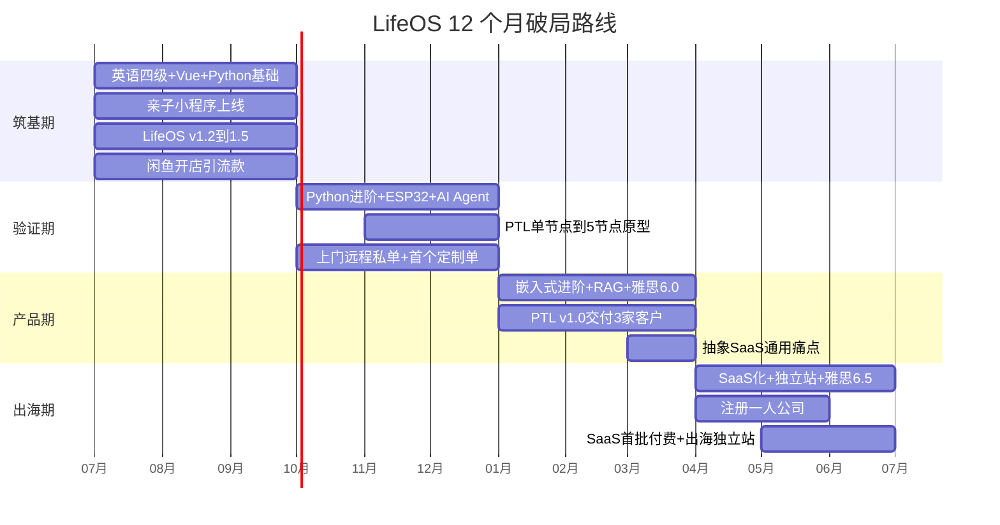
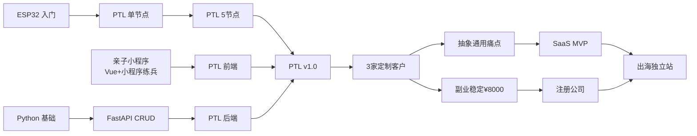

# Roadmap · 12 个月月度路线图

> 上承 `Goals.md` 的 11 个 OKR，下启 `Daily/` 每日行动。
> **每月只列 ≤ 3 个必达里程碑**（M1/M2/M3），其余为支线。
> 每月最后一天用 `lifeos review` 更新完成度百分比。
>
> **本文件是 OpenClaw 每天生成 Today.md 的核心引用源**（Vision → Goals → **Roadmap** → 昨日 Daily）。

---

## 🧭 路线全景（一句话）

> **用 AI × 六项技能（AI/英语/Vue/Python/嵌入式/小程序），以真实项目驱动学习（PBL），先做软硬件定制化交付（PTL 为旗舰）赚现金流，把通用痛点提炼成 SaaS 出海，在副业稳定后注册一人公司。**

---

## 🗓 四阶段总览（甘特图）

---

## 🟩 筑基期（2026-07 ~ 09）

> 主题：**打地基 + 出第一个作品 + 破副业零单**。这个阶段不追求赚钱，追求"能跑通 + 能交付 + 建立每日节奏"。

### 2026-07（本月）
- **M1** Laravel 后端 API 路由跑通 + 惩罚/扣分机制设计（KR9.1 / KR9.2）
- **M2** LifeOS v1.2 骨架 + `lifeos start` 三容器绿灯（KR11.1）
- **M3** 闲鱼开店 + 破零第一单（KR7.1）
- 支线：AI 工具链落地（Cursor / Claude Code）｜减脂启动 70→68kg｜英语每日 45min 开跑

### 2026-08
- **M1** Vue 3 教程通关 + TodoList 作品（KR3.1）
- **M2** Python 基础通关，能写 100 行内脚本（KR4.1）
- **M3** 亲子小程序管理后台（Vue + Element Plus）（KR3.2）
- 支线：AI 工具链效率 +50% 验收（KR1.1）｜公司形态开始调研（KR8.1）

### 2026-09
- **M1** 亲子任务积分小程序**上线微信**（KR3.3 / KR9.3）
- **M2** ESP32 五个入门实验跑通（LED/按键/WiFi/MQTT/OLED）（KR5.1）
- **M3** 英语四级模拟 ≥ 500 分（KR2.1）
- 支线：闲鱼累计 ≥ 20 单（KR7.1）｜减脂中期检查

---

## 🟨 验证期（2026-10 ~ 12）

> 主题：**把技能拧向 PTL + 做出软硬件第一个原型 + 副业客单价提升**。这个阶段核心是验证"软硬件结合"这条路走不走得通。

### 2026-10
- **M1** FastAPI + PostgreSQL CRUD 项目（KR4.2）
- **M2** 亲子小程序 Vue 后台 + FastAPI 备用后端（AI 辅助编码）（KR9.4）
- **M3** 减脂达标 ≤ 64kg + 腰围 -8cm（KR10.1）⭐健康硬指标
- 支线：RAG 项目启动（LifeOS Knowledge 知识问答）（KR1.2）

### 2026-11
- **M1** PTL 单节点原型（ESP32 + 数码管 + 按键 + WiFi 上报）（KR5.2 / KR6.1）⭐生死里程碑
- **M2** RAG 项目完成（KR1.2）
- **M3** 副业客单价提升到 ≥ ¥500（KR7.2）
- 支线：内容账号选平台 + 首批发布（PTL 过程即素材）（KR7.1 内容线）

### 2026-12
- **M1** AI Agent 项目（闲鱼订单自动回复 + 分类）（KR1.3）
- **M2** LifeOS Core（planner / reviewer / orchestrator / memory）（KR4.3 / KR11.2）
- **M3** 新概念 3 精读全 60 课（KR2.2）
- 支线：公司形态调研定稿（KR8.1）｜半年复盘 + 年度 Review

---

## 🟧 产品期（2027-01 ~ 03）

> 主题：**PTL 从原型到可交付 + 首次真实付费 + 抽象 SaaS 痛点**。这个阶段核心是从"能做"到"有人付钱"。

### 2027-01
- **M1** PTL 5 节点联网 demo（MQTT + 后端调度）（KR5.3 / KR6.1）
- **M2** PTL 第 1 个付费客户（¥500+）（KR6.2）⭐首次真实付款
- **M3** 签约 ≥ 2 家小微企业月费（软硬件维护 ¥1,500/月/家）（KR7.3）
- 支线：嵌入式笔记累计 20 篇（KR5.5）

### 2027-02
- **M1** PTL 后端 v1（设备通信 + 订单调度 + WebSocket）（KR4.4）
- **M2** PTL 管理后台（Vue）+ 移动端小程序（KR3.4）
- **M3** 雅思冲刺集训（KR2.3 准备）
- 支线：内容账号粉丝破千

### 2027-03
- **M1** PTL v1.0 交付 ≥ 3 家客户（KR6.3）⭐产品里程碑
- **M2** 雅思首考 ≥ 6.0（KR2.3）
- **M3** 抽象 3 个 SaaS 通用痛点 → `ProjectNotes/PTL/saas-discovery.md`（KR6.5）
- 支线：PTL AI 模块（语音下单 / 图像识别拣货）启动（KR1.4）

---

## 🟥 出海期（2027-04 ~ 06）

> 主题：**量产 + 注册公司 + SaaS 化 + 出海第一步**。这个阶段核心是把定制化沉淀成可复制的复利模式。

### 2027-04
- **M1** PTL 量产版第一批 10-20 个（PCB + 3D 打印外壳）（KR5.4）
- **M2** 满足双前提 → 启动**一人公司注册**（KR8.2）
- **M3** 副业净入 ≥ ¥8,000 达标（KR7.5）
- 支线：SaaS 架构设计（多租户 + Stripe）

### 2027-05
- **M1** PTL-SaaS v0.1 MVP（多租户 + Stripe 付费）（KR6.6 / KR4.5）
- **M2** LoRA 小模型微调部署到 PTL 私有场景（KR1.5）
- **M3** 公司对公账户 + 开票能力 + 基础财税代理到位（KR8.3）
- 支线：英文独立站搭建

### 2027-06（收官）
- **M1** 英文独立站上线 + SaaS 首批 ≥ 3 家付费订阅（月费 $29+）（KR6.7）⭐出海第一步
- **M2** 雅思 ≥ 6.5（KR2.4）
- **M3** 定制客户累计 ≥ 5 家 + 首个公司主体合同 ≥ ¥5,000（KR6.4 / KR8.4）
- 支线：`lifeos` CLI v2.0（KR11.3）｜年度大复盘｜制定 2027-2028 新 Roadmap

---

## 📊 里程碑依赖关系（谁卡谁）

**关键路径**：ESP32 → PTL 原型 → PTL v1.0 → 定制客户 → SaaS → 出海。
**任何一环延迟，后面全体顺延** —— 所以 2026-11 的 PTL 单节点原型是全年第一个"生死里程碑"。

---

## 🚨 全年 5 个生死里程碑（挂了必须复盘调整）

| 时间 | 里程碑 | 为什么生死 |
|------|--------|-----------|
| 2026-09 | 亲子小程序上线 | 证明能独立交付软件产品 |
| 2026-11 | PTL 单节点原型 | 软硬件结合能力的第一次验证 |
| 2027-01 | PTL 首个付费客户 | 证明有人愿意为你的东西付钱 |
| 2027-03 | PTL v1.0 交付 3 家 | 从"能做"到"可复制" |
| 2027-06 | SaaS 首批付费 + 出海 | 商业模式从定制走向复利 |

---

## 💰 现金流月度锚点（与 Goals 同步）

| 月份 | 副业目标 | 累计副业 | 储蓄目标 | 阶段标志 |
|------|---------|---------|---------|---------|
| 2026-07 | 500 | 500 | 2,800 | 破零 |
| 2026-08 | 1,000 | 1,500 | 3,000 | — |
| 2026-09 | 1,500 | 3,000 | 3,500 | 小程序上线 |
| 2026-10 | 2,500 | 5,500 | 4,500 | — |
| 2026-11 | 3,000 | 8,500 | 5,000 | PTL 原型 |
| 2026-12 | 4,000 | 12,500 | 6,000 | 半年复盘 |
| 2027-01 | 5,000 | 17,500 | 7,000 | 首个付费客户 |
| 2027-02 | 5,000 | 22,500 | 7,000 | — |
| 2027-03 | 6,500 | 29,000 | 8,500 | PTL v1.0 |
| 2027-04 | 8,000 | 37,000 | 10,000 | 注册公司启动 |
| 2027-05 | 10,000 | 47,000 | 12,000 | SaaS MVP |
| 2027-06 | 12,000 | 59,000 | 14,000 | 出海第一步 |

**12 个月副业累计目标：≥ ¥5.9 万｜储蓄累计：≥ ¥8.3 万**

---

## 🩺 健康主线（贯穿全年，不可欠账）

| 阶段 | 体重目标 | 关键动作 |
|------|---------|---------|
| 筑基期 07-09 | 70 → 66kg | 戒宵夜 + 每周运动 5h + 睡眠 7.5h |
| 验证期 10-12 | 66 → 64kg | 12 周减脂达标（KR10.1）+ 腰围 -8cm |
| 产品期 01-03 | 稳定 63-64kg | 力量为主，防反弹 |
| 出海期 04-06 | 63-64kg 稳定 | 全面体检 + 指标闭环（KR10.6）|

> **红线**：连续 3 天睡眠 < 6h 或熬夜 > 2 次 → 本周副业强制暂停。健康不达标，前面所有里程碑归零。

---

## 🧠 每月 PBL 检查（每月末必答）

1. **本月学的六项技能，分别用在了哪个真实项目？**（答不上就是白学）
2. **AI 在本月替我省了多少时间？效率提升有没有到 30%+？**
3. **本月产出的东西，有没有变成 GitHub commit / 客户交付物 / 内容素材？**
4. **哪个技能学了却没用上？下月是砍掉还是补个项目载体？**

---

## 🔄 更新记录

| 日期 | 版本 | 变更 |
|------|------|------|
| 2026-07-20 | v1.0 | 初版，12 个月路线定稿（AI × PBL × 双轨制 × 健康主线）|

---

*Roadmap 是活的。每月复盘时，允许调整未来的月，但当月的 M1/M2/M3 一旦定下就不许改 —— 那是对自己的承诺。*

